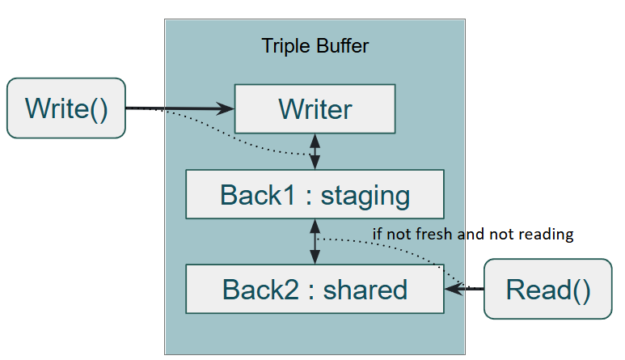

# MPMC Lock-Free Triple Buffer

A lock-free triple buffer implementation for 
low-latency snapshot sharing in multithreaded environments.

## Overview


- **Writer**: exclusively writes to local buffer
- **Back1 (Staging)**: completed writes wait here
- **Back2 (Shared)**: all readers reference this

## Design
### Bit-packed flag (uint16_t)
```
┌───────┬───────┬───────────────┐
│ 8000  │ 4000  │ 3FFF (reader) │
│ write │ fresh │ read count    │
└───────┴───────┴───────────────┘
```
- **write (0x8000)**: locked during back1 swap
- **fresh (0x4000)**: back2 holds latest data, cleared on write
- **reader count (0x3FFF)**: active readers referencing back2

> ABA-safe: cycling back to flag==0 implies a new write has occurred

## When to use
- Short read operations (pointer copy level)
- Latest-snapshot-only workloads
- Actor model state exposure to external readers

## When NOT to use
- Long read operations (I/O wait, heavy computation)
- Ordered update processing → use MPMC Queue instead
